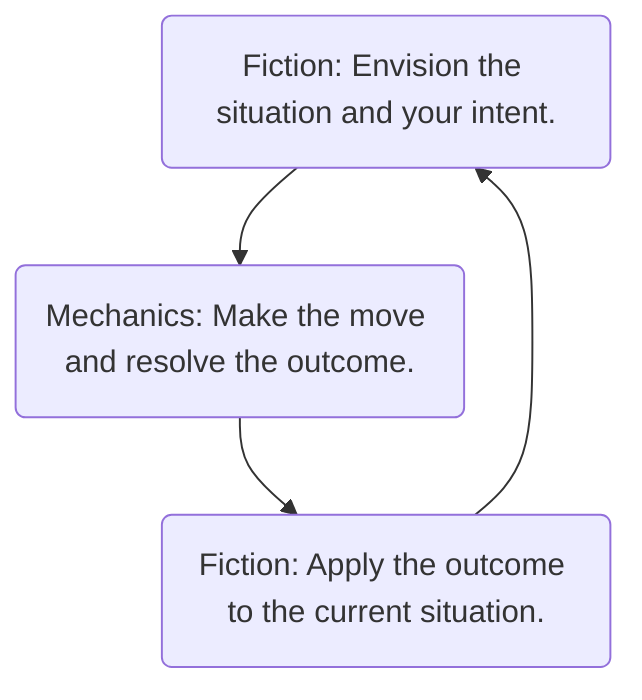

# Starting Your Campaign

^e38f17

An Ironsworn campaign is a series of connected game sessions. You will explore your world and the life of your character as you swear vows and struggle to see them fulfilled. You will journey across the Ironlands, run afoul of troubles, fight fearsome foes, and form bonds with people and communities. Through it all, you make decisions as your character and explore what it means to be Ironsworn in a harsh land.

To get started on your campaign, follow the steps described in this section.
## Create Your Character 
Refer to the [[character creation summary]]. Envision your character, considering their motivations, skills, background, appearance, personality, and connections to the world. Set your stats and pick your assets in whatever order you prefer. Give your character a name.

If you are playing co-op or guided, talk over your character with the other players and establish your connections to each other. You can shorthand your ideas for now, and flesh them out in play.

Feel free to intermix world creation and character creation. The choices you make about your setting may determine the options available to your character. Is magic unknown in this world? If so, you may want to ignore the ritual assets.

>[!example]-
>You envision your character. Your family was part of a raider clan. You were born to battle, but left that life behind long ago. Now, you live as a farmer. Your sword, long unused, hangs above the mantle in your modest home. Your armor is stored in a chest at the foot of your bed. Only those closest to you are aware of your former life among the raiders. Others know you for your loyalty to the village and your stubborn determination to help see them through the unforgiving winters. In quiet moments, your dark mood betrays the shadows of your past.
>
>You set your stats. Your iron is 3, representing your strength, prowess in battle, and fierce resolve. Then, 2 for heart and wits, and 1 for edge and shadow. For your assets, you choose Shield-Bearer and Veteran. You’re not sure about your third asset, so you decide to pick it once you are further along in creating your world and starting situation.
>
>Finally, you give your character a name: Saskia
## Create Your World
If you are playing in the Ironlands or a similar setting, work through the ‘Your Truths’ exercise starting on page 122. Review the options and make selections. Keep an eye out for quest starters which trigger an idea for a background vow (page 195) or an inciting incident (page 196).

Next, choose where your story begins. Have a look at the regions on page 112. Where are your characters located? Are they part of a community, or wandering the wilderness? Talk it out with other players and envision the setting. Mark the location on your map.
>[!example]-
>You envision some basic characteristics of your home village. It is a small settlement along the southern fringes of the Havens. It is surrounded by fields and sits astride a wide river.
>
>You roll on the [[Settlement Name table]], and the oracle answers, “Cinderhome.” You envision the burnt ruins of the former longhouse. It is a place haunted by a long-dead overseer who died in the fire.
>
>You mark Cinderhome on your map. This is where Saskia’s adventures begins.

If you prefer, you can just spend a few moments defining some basic facts for your world. Jump in and discover the rest in play.

If you are using your own setting or one drawn from another source (such as an RPG, book, or film), you can leverage the information on that setting to determine your character’s situation and the troubles you may encounter.

### Collaborating to Build Your World
If you are playing a co-op or guided campaign, you should work through the initial process of worldbuilding with the other players. Depending on your preferences, you can spend a few minutes quickly roughing out the basics of your setting, or you can dive deep for an hour or two of collaborative creation. Talk it over with the other players to ensure you have the same expectations for your initial session. Even if you give this initial activity some focus, leave open questions and blank spaces to fill in through play.

If you are the GM, you should facilitate discussion and contribute to the worldbuilding. Take cues from the players and make suggestions to help formulate potential quests and adversaries.
## Mark your Background Bonds
Give yourself up to three bonds (page 36). These bonds may be to a community or an individual. You do not need to make the Forge a Bond move for these starting bonds. Mark a tick for each bond on your character sheet (1 tick per bond), and make note of them.

If you are playing guided or co-op, you can use these starting bonds as your connection to other player characters. Otherwise, you may establish bonds with those characters though play.

If you’d rather jump right into play, you can flesh out the details of your background bonds later. Consider these bonds held in reserve until you decide to bring them into your narrative. If you later introduce a background bond for a character or community, mark the bond. Then, envision how this bond was previously established and how this relationship impacts your story.
>[!example]-
>You mark one bond for your home village. You also envision an NPC, the clan overseer, who is a good and loyal friend. She is one of the few who knows of your former life as a raider, but does not hold it against you. “We can remake ourselves,” she once told you. “Like a broken sword reforged.” You give her a name and mark the bond.
>
>You don’t have any ideas for your third bond, so you keep it in reserve. You can allocate it as you explore your starting situation.
>
>You decide the background bond with the overseer fulfills the requirement of the Banner-Sworn asset (“When you mark a bond with a leader or faction”). You take it as your third and final asset.
## Write your Background Vow
When you create your character, you give yourself a background vow to represent a primary motivation or ultimate goal. This vow is part of your character’s backstory. It may be a vow sworn years ago, or one which is a reaction to some recent, major event.

Write down this vow and give it a rank of extreme or epic. You don’t need to make the Swear an Iron Vow move for this quest.

Fulfilling this vow will not be easy. In story-time, it might require months, years, or even decades to see this vow fulfilled or forsaken. You may even decide your background vow isn’t something you make significant progress on in your narrative. Instead, it just helps establish some roleplaying detail for your character and fleshes out your world.

>[!example]-
>Your backstory involves your former life as a raider. Haunted by your past, you have sworn to see this raider clan defeated. However, there are complications. The clan is powerful, and you couldn’t possibly hope to defeat them without an army at your back. Also, the clan is led by your own mother. It’ll take a special sort of courage to face her again. 
>
>You envision the clan’s name: “Red Moon.” Their shields are decorated with a blood-red circle.
>
>For now, this vow is a glowing ember, a promise not yet sparked to flame. You mark the vow as “Defeat the Red Moon clan”, giving it a rank of extreme.
## Envision Your Inciting Incident
An inciting incident is the problem which arrives at the beginning of a story, propelling the protagonist into action. Everything up to that point is backstory—the normal world to which your character has become accustomed. In Ironsworn, the inciting incident is the tipping point which forces you to undertake a life of perilous quests and adventure.

To start your character’s story, envision an imminent threat or compelling need. You can use a quest starter from this book (see chapters 4 and 5), talk it out at the table, or Ask the Oracle (page 107). This problem dictates what drives your first session and sets your character’s story in motion.

>[!question] What makes a good inciting incident?
>- **Make it personal**. Why is this important to your character? Envision how this connects to your background and motivations. Also, consider how you can leverage story themes which are interesting to you as the player.
>- **Make it a problem that won’t go away on its own**. The threats or forces at the heart of this situation will see it through, even if you ignore them.
>- **Give it a ticking clock**. The problem won’t wait for you. If you don’t act or encounter delays, things will get worse.
>- **Make it universal**. If you are playing with allies, make this a shared vow important to each of you. This creates an opportunity to work together. If you are playing solo, make it a threat which impacts other people you care about.
>- **Up the stakes**. Envision complications which make your inciting incident even more dire for you, your family, or your community.
>- **Limit the scope**. Unlike your background vow, this is a problem which you can (and must!) deal with now. In gameplay turns, you Swear an Iron Vow and mark it as a troublesome, dangerous, or formidable quest. If all goes well, it might be resolved in a session or two. If you don’t act, things will get worse.

These suggestions can apply to any vow, but are especially relevant for an inciting incident. Even if the details are not clear to you, envision how the problem can lend itself to a rich narrative full of drama, conflict, and surprises.

>[!example]-
>A mysterious sickness has struck Cinderhome’s overseer. The village healer brewed draughts, but none offered any relief. The priest prayed, but the gods did not listen. The mystic performed divinations, but the shadows did not divulge their secrets.
>
>The overseer, your friend, is fading. Without help, she will surely die. To add a bit more drama and stakes, the families in your community are now at each other’s throats as they start to position their preferred candidate to take up the iron circlet. If the overseer dies, open conflict may break out. The community will be weakened and may not survive the coming winter.
>
>You pile on the stakes until it feels like an imperative. You must take on this quest.
## Set the Scene
You have two options for starting play: You can begin with the normal world, or in media res.

### The Normal World
Envision a prologue involving your character which helps to flesh out who you are and how you interact with your world. If you have allies, this is an opportunity to roleplay your relationships and introduce your personality and backgrounds. Your inciting incident can then serve as an event or threat which you encounter in play during your first session.

>[!example]-
>You want to spend a bit of time exploring your character and your world before you kick things off with your overseer’s sudden illness. Your village is celebrating the spring festival, and you are taking part in a boar hunting competition. You roleplay scenes and make moves as you interact with other hunters, track your quarry, and attempt to bring down a particularly large and vicious boar. When you return to the village, you learn that the overseer has fallen ill.

If you are having trouble coming up with your initial quest, you can use the prologue to jump in and discover a dramatic situation through play. Ask questions about the characters, your world, and the current situation. Draw conclusions to those questions or Ask the Oracle. Look for opportunities in the fiction to trigger a vow.

### In Media Res
In media res is a Latin term meaning “in the middle of things.” You start your story at a crucial point. Your inciting incident is happening now, or is something you are fully aware of and must react to. The raiders are attacking. The usurper claims the iron circlet. The marauding beast appears.

You can begin with a tense, action-oriented scene as you encounter the problem. Or, you might frame a scene where you Swear an Iron Vow, letting the result of that move trigger what happens next.
>[!example]-
>You envision a scene in the longhouse as you visit your stricken overseer. She lies in bed, her features as pale as death, her breathing ragged. There are others here: The village healer, the overseer’s wife, and a rival who feigns concern. Ignoring them, you stride forward. You draw your sword...
## Swear an Iron Vow
To set your quest in motion, as a response to the inciting incident, make this move (page 98). But first, start with the fiction. Envision the scene. Describe what you say and how you perform the ceremony. This is an important moment for your character.

>[!question] What was the result of your move?
>- Did you score a strong hit? Envision your first steps. Do you Undertake a Journey? Do you Compel someone into action? Play to see what happens next, and make moves as appropriate.
>- Did you score a weak hit? Your next steps are unclear. This may typically lead to new scenes and new moves. Perhaps you Gather Information (page 62) as you try to identify a path forward.
>- Did you score a miss? An unexpected danger or obstacle stands in your way. Envision what it is, or Ask the Oracle (page 107). Then, play to see what happens as you attempt to overcome this stumbling block. For an inciting incident, give your new vow a rank of troublesome, dangerous, or formidable.

>[!example]-
>You envision the scene as you kneel before your overseer. You curl your hands tight around the iron blade of your sword—so tight that you open a cut in your palm. You pay the wound no mind. The blood fuels the promise. “I will see you healed,” you say. “I swear it.”
>
>You roll the dice. Because you have the Banner-Sworn asset and serve the overseer, you may reroll any dice. It’s a strong hit. A good omen. You write your vow on your character sheet and give it a rank of dangerous. Per the move outcome, “you are emboldened and it is clear what you must do next.” What do you know about this disease? What’s your likely path forward? Envision the answer, talk it out, or Ask the Oracle (page 107).

### Sharing Your Vow with Allies
If you are playing with allies, only one of you will make the Swear an Iron Vow move. Other players can make the Aid your Ally move (page 76) as a way of representing their own commitment to this vow. If you share this quest with your allies, each of you write the vow and any progress is marked by all players.
## Next Steps
Depending on the result of your Swear an Iron Vow move, your character may have a clear path forward, may have more questions than answers, or may need to overcome an immediate obstacle or threat before they can undertake their quest. You, as the player or GM, interpret what this result means. Not sure where to begin? Ask the Oracle.

>[!example]-
>You’ve sworn your vow and scored a strong hit, which means the next steps—from your character’s perspective—are clear. As the player you don’t know where to begin. Are there any clues to the source of the sickness? You Ask the Oracle by rolling on the Action and Theme tables (page 174).
>
>The oracle answers, “Leave” and “Trade.” What does it mean? Your first instinct is to interpret this answer as having something to do with a trade caravan. Perhaps one left your village on the same day the overseer fell ill? There must be a connection.
>
>With your immediate goal in sight, you can roleplay your preparations and Undertake a Journey (page 65) to set off after the caravan.
## Creating a Quest Outline
If you find it helpful, you can envision and write down the main narrative steps in your quest. What journeys must you undertake? Which enemies will oppose you? What information must be found? Who do you need help from?

Your outline should give you ideas for the scenes and challenges which can be part of your quest, with each major step an opportunity to make the Reach a Milestone move (page 100). However, you should consider it a sketchy, unreliable plan at best. It is like an ancient map with “here there be monsters” written in blank spaces.

If you are a GM and have some ideas for challenges and events in the quest, make note of them. However, don’t get locked into a specific path which must be followed. Whether you are a GM or a player, leave yourself open to

surprises, new ideas, input from others at your table, and the whims of fate. Be prepared to toss even the mostly loosely defined plan out the window. Put simply, play to see what happens.

>[!example]-
>You consider the steps you’ll take to Fulfill Your Vow. You need to find the caravan, identify the cause of the illness, locate a cure, and return back to Cinderhome to heal the Overseer. You write the milestones down.
>
>In your outline, you include a note about a healer in the Tanglewood forest. You like the idea of a woodland adventure and a mysterious old herbalist who may want something in exchange for a cure. Your story might not lead in that direction, but it gives you an interesting potential narrative checkpoint.
>
>That’s four milestones, which is about right for a dangerous quest (two progress per milestone). But, these may change depending on where the story takes you. At the moment, much is unknown.
## Campaign Setup Summary
> [!tldr] Campaign Setup Summary
> 1. Create your character (page 193). Envision your character. Choose your name, set your stats, and select your assets. Refer to chapter 2 (page 31) for details. If you prefer, you can start by creating your world (below).
> 2. Create your world (page 194). If you are playing in the Ironlands, refer to chapter 4 (page 111) and the ‘Your Truths’ exercise (page 122). Otherwise, establish the basic truths of your own world. Envision where your story will begin and mark it on your map.
> 3. Create your background bonds (page 195). Mark up to three bonds to represent your connections to home, friends, family, or other loyalties. Make note of these bonds, and mark a tick for each.
> 4. Write your background vow (page 195). Create a sworn quest as backstory for your character. Write down this vow and give it a rank of extreme or epic. You don’t need to make the Swear an Iron Vow move for this quest.
> 5. Envision your inciting incident (page 196). Come up with the problem that drives your character into action.
> 6. Set the Scene (page 198). Decide whether you want to start with a prologue (the normal world), or in the midst of the problem (in media res). Envision the scene and begin play.
> 7. Swear an Iron Vow (page 199). Make the move and write down your vow. Give it a rank of troublesome, dangerous, or formidable.
> 8. Take your next steps (page 200). Based on the outcome of your Swear an Iron Vow move, envision what you do or what happens next. If you like, you may outline the milestones of your adventure. Then, play to see what happens.
> ^campaignsetupsummary

# The Mechanics and the Fiction

^00e1e9

Ironsworn is a game. As such, it uses various mechanics to resolve situations and challenges. You make moves and roll dice. Your character uses stats, tracks, and assets as a representation of their abilities and readiness. The outcome of a move may have a mechanical impact, such as increasing your momentum track or reducing your health track. Managing your resources and making decisions based on a desired mechanical result is part of the challenge and fun of the game.

The fiction helps you define and understand your setting and your character. It guides your character’s background, personality, and motivations. It provides a framework for the situations you face, the world you inhabit, and the people and creatures you encounter. As you play, you take actions through the imagined perspective of your character. The fiction helps inform what happens next.

	The intersection of fiction and mechanics is what makes the roleplaying experience vibrant and compelling. Think of the mechanics as your needle and the fiction as your thread. Using them both, you will weave the tapestry of your Ironsworn story.
## Leading and Following with the Fiction
Without story, the game is an exercise in rolling dice. Without mechanics, your story lacks choices, consequences and surprises. An ideal session of Ironsworn leverages both the mechanics and the fiction, but leads and follows with the fiction.

What does that mean? Consider the fiction as the bookends to your moves. You start by picturing the situation. What is happening? What are you trying to do? How are you doing it? What opposes you? What complications might you face? If you are playing solo, envision it. If you are playing co-op, talk it out. If you are the GM, set the scene for your players and work with them to clarify any details.

Does the fiction trigger a move? If so, make it. Roll the dice. Deal with the mechanical outcome within the context of the current situation. If one of your status tracks—health, spirit, supply, or momentum—is adjusted as a result of a move, envision how this looks in the fiction. Don’t just move the numbers around. Picture what it means for your character’s readiness and well-being. Then, translate the result of your move back to the fiction. How does the situation change? What happens next?

### Finding Your Balance
The level of emphasis you give to the fiction varies by the situation and the desired pace of play. You can explore entire scenes—such as interactions with your allies and other characters—entirely through the fiction without engaging in moves. Other times, you may quickly gloss over the fiction to get on with things. That’s fine. Use the mechanics of moves to portray the inherent drama and uncertainty of character intent and obstacles, but always look for opportunities to add texture and vibrancy to your world through the fiction.
>[!example]-
>You envision a quick scene as you return home and gather your gear. There’s no move triggered here. You pack your supplies and don your armor. The mail shirt is heavier than you remember, as if weighed down by dark memories.
>
>You stand at the door for a moment. Your hand rests on the hilt of your sword. “A blade never bloodied is a waste of iron,” your mother once told you. You remember her words now, and say a quick prayer that your sword will not be drawn. It has seen enough blood.
>
>Time is short. You must begin your quest.
## Fictional Framing
Ironsworn does not emphasize situational mechanics. Instead, the details are often abstracted within your moves and are reliant on fictional framing.

Think of it like moving a chess piece. Is it a pawn or a queen? What square is it on? What other pieces are on the board? What is the state of the game? All of these considerations impact the move you make and what happens next. There are rules. You can’t simply decide to move a pawn three spaces or sweep the enemy pieces off the board.

Gameplay within Ironsworn is much less constrained than in chess, but is still framed by the rules of your narrative reality. Your actions and the events in your story need to make sense for the characters, the setting, and the fiction you have established through play. Your character’s background, skills, beliefs, goals, and equipment all contribute to the actions you can take and how you envision those actions—even when those elements aren’t defined by a stat or asset. NPCs don’t have detailed mechanical attributes, but are portrayed as appropriate to the characteristics and intent you’ve established through play.

Fictional framing is your polestar. It helps create a character, a world, and situations which feel authentic and consequential.

>[!question] How does fictional framing impact play?
>- It adds texture to your story. Adding detail enriches your narrative, creates opportunities for new challenges and quests, and helps you visualize your character and your world.
>- It determines the moves you cannot make. If you are not properly equipped or positioned to make a move, you can’t do it. Without a very strong incentive, you can’t Compel a hated enemy to help you.
>- It determines the moves you must make, or those you can avoid. If you are unarmed and want to Strike a spear-wielding foe, you should Face Danger or Secure an Advantage to get in close. If you need information from someone and already have their trust and cooperation, you won’t need to Compel them before you can Gather Information.
>- It guides the outcomes of your moves. Look to the fiction when you have a question about the outcome of a move, especially when you Pay the Price. Do you suffer a mechanical result such as harm? Do you face a new narrative complication? If in doubt, Ask the Oracle and apply the context of your fictional framing to interpret the answer.
>- It helps determine the rank of your challenges. The rank you give to your quests, journeys, and fights is influenced by the scope of the challenge within the fiction.

>[!example]-
>For example, imagine you are caught within a snow storm while traveling. Winter in the Ironlands can be brutal. How does this storm and your character’s readiness impact your story? Establishing facts through your fiction, whether as an outcome of a move or simply as a narrative flourish, helps frame the challenges you face.
>
>#### The narrative texture of your story.
>If you encounter a harsh winter storm in your travels, the driving snow and biting wind adds evocative details to your journey.
>#### The moves you $CANNOT$ make
>If you are exiled from a community, you can't Sojourn there to seek shelter from the storm.
>#### The moves you $MUST$ make (or $CAN AVOID$).
>If you are caught in the storm without a heavy cloak and furs, you'll need to Face Danger to withstand the brutal cold.
>#### The outcome of your moves
>If you score a miss as you Face Danger to endure against the storm, you will likely suffer harm, stress or a loss of supply. Or, perhaps you encounter a threat even greater than the storm.
>#### The rank of your challenges
>The frostbound emerges from the blinding snow, its dead eyes flaring with a cold light. You grip your sword, your hands shaking and numb, and Enter the Fray. You decide the frostbound would be mystically empowered by the winter storm, so you set its rank one higher. This makes it an extreme foe.

In co-op and guided modes, you collaborate to create a shared understanding of the current situation. If something is unclear or at odds with the assumptions of another player, take a moment to talk it out until everyone has a clear picture of the situation. When playing solo, you are the arbiter of this fictional reality. Either way, find opportunities to increase the stakes and introduce dramatic new challenges and conflicts. Bend the fiction, but don’t break it. Push your characters. Subvert your expectations.

>[!example]-
>You must set off in pursuit of the trade caravan, but traveling on foot doesn’t make sense within the established fiction. They have a lead of more than a day. Catching up with them requires a horse.
>
>The characteristics of a horse aren’t defined within the Ironsworn rules. We’re not concerned with how much a horse costs, its travel distance per day, how fast it can run, or how much it eats. The Horse companion would give Saskia a mechanical bonus in some situations, but you don’t have that asset as part of your character.
>
>The function of a horse, then, is to add narrative texture to your travels and influence the moves you can make and their outcome. For now, traveling on horseback gives you the fictional framing you need to Undertake a Journey in pursuit of the trade caravan.
>
>Does Saskia own a riding horse? You decide to Ask the Oracle, and give it 50/50 odds.
>
>“No,” the oracle answers. So, where do you go from here? It’s reasonable to assume the overseer’s wife would lend you a horse.
>
>This is part of the fictional framing you have established through your campaign setup and initial play. You are attempting to help the overseer, who is a friend. You have sworn an iron vow to do so. Borrowing a horse from her wife doesn’t sound like a situation which is uncertain or risky, and thus wouldn’t require a Compel move.
>
>You envision this horse, one of the overseer’s mares. It has a buckskincolored hide and a black mane. You give it a name, Nakata, and write it down.
>
>To flesh out a bit of detail for this animal, you roll on the Character Descriptor table, and the oracle responds, “Wary.” You make note of that as well. This horse will be skittish. If you find yourself in a perilous situation, you may need to Face Danger to control it. A horse can also be injured or killed as part of the narrative outcome of a failed move. 
>
>For now, you’ve got your horse. Time to go.
## Representing Difficulty
You might be familiar with roleplaying games that give various tasks a difficulty rating or modifier. The flexibility to make each toss of the dice contextual, to adjust the chance to succeed based on the situation, creates an experience which helps simulate your imagined reality.

However, the Ironsworn rules do not utilize fine-grained mechanics for the difficulty of a particular challenge or the abilities a foe can bring to bear. Instead, the requirements to overcome challenges in your world are primarily represented through your fictional framing
### From Hell's Heart, I Stab at Thee
A leviathan is an ancient sea beast (page 154). It’s tough to kill because of its epic rank, and it inflicts epic harm, but it doesn’t have any other mechanical characteristics. If we look to the fiction of the leviathan’s, description, we see “flesh as tough as iron.” But, rolling a Strike against a leviathan is the same as against a common thug. In either case, it’s your action die, plus your stat and adds compared to the challenge dice. Your chances to score a strong hit, weak hit, or miss are the same.

So how do you give the leviathan its due as a terrifying, seemingly invulnerable foe? You do it through the fiction.

If you have sworn a vow to defeat a leviathan, are you armed with a suitable weapon? Punching it won’t work. Even a deadly weapon such as a spear would barely get its attention. Perhaps you undertook a quest to find the Abyssal Harpoon, an artifact from the Old World, carved from the bones of a longdead sea god. This mythic weapon gives you the fictional framing you need to confront the monster, and finding it can count as a milestone on your vow to destroy this beast.

Even with your weapon at the ready, can you overcome your fears as you stand on the prow of your boat, the water surging beneath you, the gaping maw of the beast just below the surface? Face Danger with +heart to find out.

The outcome of your move will incorporate the leviathan’s devastating power. Did you score a miss? The beast smashes your boat to kindling. It tries to drag you into the depths. Want to Face Danger by swimming away? You can’t outswim a leviathan. You’ll have to try something else.

Remember the concepts behind fictional framing. Your readiness and the nature of your challenge may force you to overcome greater dangers and make additional moves. Once you’ve rolled the dice, your fictional framing provides context for the outcome of those moves.

### Adjusting Challenge Ranks
When you Undertake a Journey, Enter the Fray, or Swear an Iron Vow, consider the fictional framing as you set the rank of the challenge. 

>[!example]- 
>- Does your voyage to the leviathan’s hunting ground take you over rough seas and near mist-shrouded rocks? That sounds like it’s worth notching up the rank when you Undertake a Journey.
>- Have you negotiated with a clan overseer to gain the aid of his fleet? When you Enter the Fray against the leviathan alongside these NPCs, you can reasonably reduce its rank by a step or two. This alliance might also allow you to Reach a Milestone and mark progress on your quest.

The rank can reflect your desired pace of play. Adjust the fiction and set the rank as appropriate to the amount of focus you want to give this challenge in your story. But, don’t go easy on your character. Prevailing or failing against overwhelming odds is the stuff of great stories. Be epic. Or die trying.
## Zooming in and Out
As the writer, director, and editor of your story (or collaborating as such with others at your table), you have control over how you manage scenes within the visualized fictional space you create.

Imagine you are in a desperate battle. Your opponent is one of the firstborn, a giant, wielding a brutal-looking axe. He’s an outcast of his own clan, and is warring against the Ironlanders. He’s nine feet tall. Scary as hell.

You fight with a spear and shield. You Face Danger, ducking under a wild swing of the axe. A strong hit. You have initiative. Next, you Strike, lunging with the spear, and roll a weak hit. You slam the spear into the giant’s leg.

That’s 2 harm. Mark the progress. Unfortunately, your foe has the initiative. What happens next?

Imagine time frozen. Picture the scene. Morning mist hangs above the ground. The sun is low, casting long shadows. Specks of blood are suspended in the air. Your expression is a mix of determination and fear as your eyes focus on the point of the spear, embedded in the giant’s massive leg. He is reacting to the hit, head back, mouth agape. His massive axe is held high.

This is a moment of high drama. Linger on it for a moment. Imagine what the giant does next. Does he attack with the axe? Does he kick at you? Does he try to grab your spear and snap it in half? Look to the fiction. If you’re unsure, or want to leave it open to fate, Ask the Oracle.

Time moves again. The frantic battle continues. The giant acts. You react. Roll for it, and interpret the result. Remember: It’s fiction first, then the move, then back to the fiction as you resolve the outcome. If it’s interesting, supports your fictional framing, and compounds the tension, make it happen.

Even in a situation where seconds count, such as combat, you can shift the focus and flow of time. A Strike might be a single, decisive blow. Or, it might represent a flurry of attacks and blocks leading to a pivotal moment. Don’t treat a fight as a series of discrete rounds. Mix it up. There’s even a special move for combat, Battle (page 84), which lets you zoom out and abstract an entire engagement in a single roll.

Later, after you’ve defeated the giant, you continue on your quest. You’re making your way into the mountains. You roll to Undertake a Journey and score a weak hit. You imagine it as a montage. You are moving from dense forest into jagged hills. You rest only once, pausing to eat alongside the banks of a surging river. Your eyes are narrowed and your expression wearied as you scan the difficult terrain ahead.

Time is compressed. An entire day passes. If your roll had failed, something went wrong. What happened? Find out, then slow down and zoom in if appropriate.

This is the ebb and flow of play. Time is fluid. The moves help dictate this flow, but you also have control. If it’s interesting to you, if it impacts your story, focus on it. If not, abstract it.

>[!example]- 
>You set off on your quest. You envision looking back one last time at your village, muttering a prayer to the old gods to keep the overseer alive until you return.
>
>You make the Undertake a Journey move, giving your journey a rank of dangerous, and roll a strong hit. You mark progress, and take the option to preserve your supply. You zoom out to envision a good first day of travel. You head south along the trade road, which is little more than a muddy path meandering through the low hills. The weather is fair. You catch a nice fat rabbit for dinner.
>
>You Ask the Oracle for guidance on your first waypoint by rolling on the Location (page 176) and Location Descriptor (page 177) tables. The oracle answers, “Mystic site” and “Beautiful.”
>
>You interpret this answer as a set of standing stones the locals call ‘The Three Maidens’. Looking for a bit more detail, you roll on the Action and Theme tables. The oracle responds, “Communicate Dreams.”
>
>That night, as you sleep, three spectral women appear and speak to you urgently in a language you don’t understand. Do these spirits offer a blessing or a curse? You make note of this enigmatic vision. It could be an interesting narrative hook to explore later.
>
>You Undertake a Journey three more times, rolling hits and marking progress. You mostly stay zoomed out, picturing Saskia keeping a resolute pace in pursuit of the caravan. Then, you Make Camp, but score a miss. You envision a troubled and anxious night, plagued by bad dreams, and Endure Stress.
>
>On the next segment of your journey, you also score a miss. Per the move, you are “waylaid by a perilous event.” Your roll is a match, which means you have an opportunity to introduce a dramatic twist. 
>
>It’s time to zoom in...
# Managing Your Quests
Sworn quests are the narrative engine of your Ironsworn adventures. When you start your campaign, your character has two vows: Your background vow (page 195), and a vow triggered by an inciting incident (page 196).

Making progress in these quests requires you to face and surmount obstacles. You will undertake perilous journeys, uncover information, gain the support of NPCs, recover important items, and defeat powerful foes. Your character will struggle to overcome their own limitations and find their preconceptions and loyalties challenged.

Putting these obstacles in your path isn’t just for dramatic purposes. Succeeding against these trials, finding your way forward, enables you to reach milestones and mark progress on your quests.

	In the fiction, an iron vow is a significant, deeply held promise. If a situation is not dramatic and relevant to your character’s goals and principles, it’s probably not worthy of a vow. It might be a milestone for a quest, or simply a narrative diversion as an opportunity for roleplaying or worldbuilding.
	
	If you want to take on an Ironsworn quest, but the problem in front of you doesn’t seem meaningful enough, punch it up. Give it context. Up the stakes.

## Reaching Milestones
Imagine your Ironsworn quest as a path of stones leading across the water.

Each stone marks a major step forward—a milestone—triggering the Reach a Milestone move.

You might plan some of your quest milestones in advance (page 200). Others will emerge naturally from the fiction. The outcome of your moves or creative prompts may send your quest in unexpected directions, leading to new milestones and perhaps even new vows.

### What's Worthy of a Milestone?
The text of the Reach a Milestone move states:

	When you make significant progress in your quest by overcoming a critical obstacle, completing a perilous journey, solving a complex mystery, defeating a powerful threat, gaining critical support, or acquiring a crucial item, you may mark progress.

The pace of your quest will be largely defined by what you decide is “significant progress.” A milestone should accomplish two things:

- It should relate directly to your quest. A milestone should be meaningful to your character and your vow. An unrelated challenge which you deal with as you undertake your quest is probably not a milestone.

- It should represent a turning point or major step forward in your quest. Achieving a milestone requires effort and sacrifice for your character. A minor discovery or easy success is probably not a milestone, especially for a higher ranked quest. Not every step you take is a milestone.
### Marking Progress
Your vows utilize a standard progress track (page 14) to measure how far you have come in your quest. This progress track is a mechanical representation of the likelihood of being successful when you Fulfill Your Vow (page 101). More filled boxes means a better chance of a hit on that move. The progress track also shows how much story potential you have fulfilled in your quest. Higher ranked vows require more focus in your story and more effort and

sacrifice for your character. When you Reach a Milestone (page 100), mark progress per the rank of your vow.

- Troublesome quest: Mark 3 progress.
- Dangerous quest: Mark 2 progress.
- Formidable quest: Mark 1 progress.
- Extreme quest: Mark 2 ticks.
- Epic quest: Mark 1 tick.

>[!example]-
>You’ve scored a miss for Saskia on Undertake a Journey, and the move outcome says you are “waylaid by a perilous event.” Plus, you’ve rolled a match, which gives you an opportunity to introduce an unexpected complication or twist.
>
>You Ask the Oracle for guidance, rolling on the Action and Theme tables (page 174). The oracle answers, “Surrender vow.”
>
>You consider the meaning of this response. “Surrender” makes you think of someone ambushing you and demanding your surrender. But what about “vow”? You currently have two vows: “Defeat the Red Moon Clan” and “Save the Overseer.” What if this is an opportunity to tie them together as a way to fulfill the match you’ve rolled?
>
>Perhaps you stumble across Blood Moon clan raiders, war-kin from your former life, and they have something to do with the plot against the overseeer.
>
>You set the scene. A band of raiders step out from the woods alongside the trail, blocking your path. They have spears and bows at the ready. You envision Saskia spotting their distinctive painted shields. Her breath catches in her throat.
>
>But, you have no interest in parlaying with these raiders. You step down from your horse. You walk toward them, hands raised. You Secure an Advantage by feigning compliance, putting them at ease, and roll a strong hit. The archers relax their aim.
>
>You Ask the Oracle: “Do any of them recognize me?” You were the clan leader’s daughter and were well known. You set the odds as likely. “No,” the oracle answers.
>
>Good. They are younger raiders. Inexperienced. Left here for some mundane task. Perhaps they are serving as some sort of rear guard to watch for anyone who might go after the trade caravan.
>
>An idea occurs to you. You want to weave together these seemingly unconnected narrative threads. You have eight progress marked on your journey. Perhaps catching up with the trade caravan doesn’t need
>
>to be your destination. What if the answers you need are right here? You make the Reach Your Destination move and score a strong hit. This perilous journey is at an end. You Reach a Milestone and mark progress. Back to the scene, you envision Saskia moving closer to the raiders, then drawing her sword in a flash. You Enter the Fray...
## Undertaking New Quests
In the midst of a quest, you will encounter situations which introduce opportunities for additional vows. These new vows may be related to existing quests, or they can spring from unconnected problems.

### Secondary Quests
As you undertake a quest, you may make a promise or work to overcome an obstacle which is worthy of its own vow. Imagine this as a gap in your path, bridged by a set of milestones. This shorter path is your secondary quest. You will Swear an Iron Vow, give it a rank, and mark progress as you work to resolve this new vow.

You won’t mark progress on your main quest until you Fulfill Your Vow on the secondary quest. When the two paths converge, when your secondary quest is complete, you can Reach a Milestone on your main quest and continue along your path.

When is an obstacle its own quest instead of just a milestone? Look to the fiction. Is it a significant, self-contained challenge? Is it meaningful to your character? Does it create opportunities for new drama and conflict? If so, it’s probably worthy of a vow.

>[!example]-
>You defeat the raiders, but it’s a hard-won victory. You are wounded and your shield was shattered. Luckily, you are able to interrogate one of the surviving raiders. You play out the scene as you Gather Information to learn how the Blood Moon clan is involved in the overseer’s illness.
>
>Through a hit on that move and some questions to the oracle, you discover the raiders are indeed at the heart of this problem. An assassin traveling with the trade caravan is poisoning the leaders of Ironlander villages. The resulting strife will weaken those villages and make them ripe for the picking. Come winter, the raiders will sweep across this region like a dark tide.
>
>You also learn the nature of the poison. It is extracted from a rare plant found only in the heart of the Deep Wilds. Your mother’s schemes have grown more elaborate since you last fought beside her.
>
>These discoveries are worth another milestone. You Reach a Milestone and mark progress. This gives you a total of four progress on your dangerous vow.
>
>What next? You look back at your quest outline and are reminded of your story prompt: “Get help from the herbalist who lives deep in the Tanglewood.” Seeking out a reclusive herbalist—who can hopefully provide an antidote for the poison—sounds like a good fit for the story.
>
>You decide to gloss over the expedition into the Tanglewood and forgo the Undertake a Journey move. You’ll just put the forest nearby for the purposes of your narrative. You’re familiar with this herbalist, you decide, because she occasionally visits your village to trade.
>
>You roleplay a scene as you arrive at her ramshackle hut and try to convince her to concoct an antidote for the poison. You envision her as a cantankerous, eccentric woman, unconcerned with your quest. You try to Compel her. Unfortunately, you score a miss. Not willing to let your narrative hit a dead end, you decide she will—per the move— “make a demand which costs you greatly” Being forced to commit to a secondary quest sounds about right. For good measure, you Pay the Price and suffer -2 momentum to reflect the lost time.
>
>“A nest of harrow spiders is scuttling about,” she says. “Kill the brood mother, and bring me her fangs. I’ll need them for the antidote anyway.”
>
>She hands you an iron coin. “Swear it, or be gone. Your choice.” You Swear an Iron Vow. There is work to be done...

## Unreleated Quests
You may encounter situations—unrelated to your current vows—which your character is driven to set right. This may happen organically through the fiction, via oracle prompts, or as introduced by your GM in guided play.

If you ever find yourself without a vow, are having difficulty envisioning the next steps in a current quest, or you want to explore a new narrative, make something happen. Introduce a problem. You can use quest starters in this book, or Ask the Oracle and interpret the answer.

Several moves explicitly provide opportunities to undertake new quests as part of their outcomes. For example, if you Sojourn and choose the option to take a quest, you can introduce a trouble which this community is facing. Or, when you Forge a Bond or Compel and roll a weak hit, the NPC demands something of you. If appropriate to the fiction, this demand may require a sworn vow.

### Delayed Quests 
A quest may require you to gain something from an NPC. It might be information, an item, or aid of some other sort. However, as the outcome of a move or through the fiction, an NPC might have their own demands. They may even want you to Swear an Iron Vow as your promise to see it done.

If you do so, and the NPC is satisfied with the promise itself (for now), you can continue on your current quest. You will deal with this new vow later. If the aid of the NPC is a significant step forward on your current quest, you should Reach a Milestone.

Keep in mind that swearing an iron vow is a sacred promise. NPCs, particularly powerful ones, will hold you to it. Ignoring it means you Forsake Your Vow, which should have dramatic implications within your narrative. You’ve made an enemy, or ruined your reputation. How will others take your vows seriously in the future? How will you?
### Intersecting Quests
If you have undertaken two related quests, you may encounter a situation where a milestone allows you to mark progress on both vows at once. However, this should be a rare event. The two quests are not overlapping paths, with every step a milestone for each. Instead, imagine these paths intersecting at key moments.
## Fulfilling Your Vow
The fiction driving your quest and the mechanical progress represented by your progress track converges in the decisive moment when you believe your quest is at an end. This is when you make the Fulfill Your Vow move (page 101).

Managing your mechanical progress and the fiction to reach this moment requires a bit of stagecraft. It’s the end of the third act. Your actors need to be in position. Your sets and props need to be in place. The lights come up for the final scene...

Progress tracks can help you set the pace. If your progress track is filling up well ahead of your story, slow down the pace and focus on key objectives and turning points as milestones. If you find your story moving to a resolution well ahead of your progress track, envision some complications or twists which alter your path and create new opportunities for milestones.

However, keep in mind it’s not necessary to fill your vow’s progress track before you Fulfill Your Vow. Has the fiction led you to a moment when your quest seems complete, but your progress track is not even half full? Go with it. A weak hit or miss on the Fulfill Your Vow move can create interesting stories and reveal opportunities for new vows.

>[!example]-
>Playing as Saskia, you have killed the harrow spiders at the behest of the herbalist. You Fulfill Your Vow for the “Kill the Brood Mother” quest. This also allows you to Reach a Milestone on your “Save the Overseer” quest as the herbalist concocts an antidote.
>
>You Undertake a Journey back to Cinderhome. Since this is a return trip, and you don’t want to give it much story focus, you set it as merely troublesome. You are waylaid by a tense encounter with a protective ash bear and her cub, but eventually Reach Your Destination. This final journey also serves as a milestone on your quest. You now have eight boxes marked on your progress track.
>
>You envision the scene as you rush to the overseer’s bedside. She is as pale as death, her breathing so shallow it can barely be detected. Are you too late? Was this all for nothing? You make the Fulfill Your Vow move to find out.
>
>You roll the challenge dice. It’s a strong hit. You envision the overseer slowly improving. The color returns to her face. After a time, she wakes.
>
>Your vow is fulfilled. You earn 2 experience for the dangerous quest, and 1 bonus experience because of your Banner-Sworn asset.
## Forging New Bonds
As you pursue your quests, the relationships you form and the hardships you endure with other characters can be given fictional and mechanical significance through the Forge a Bond move (page 74).

A new bond can be a natural outcome of a successful quest. When you successfully Fulfill Your Vow in service to a person or community, you may reroll any dice if you Forge a Bond with them.

>[!example]-
>You envision the overseer’s wife cutting a braid from her hair and giving it to Saskia, a token of appreciation and respect. You kneel, and apologize that you have nothing to give but your continued service to Cinderhome and the overseer.
>
>You make the Forge a Bond move, and roll a miss. Luckily, your successful quest lets you reroll any dice. You roll again, score a strong hit, and mark the bond on your character sheet.
## Advancing Your Character
When you successfully Fulfill Your Vow, you earn experience points. This experience is spent to purchase or upgrade assets through the Advance move (page 103).

	When you focus on your skills, receive training, find inspiration, earn a reward, or gain a companion, you may spend 3 experience to add a new asset, or 2 experience to upgrade an asset.

You can spend your experience points when they are earned, or save them up for future use. Either way, you should look to the fiction to give context and justification for your new abilities. You can guide your story toward an asset you would like to purchase or upgrade, or let your selection of assets flow naturally from your character’s goals and the situations you encounter.

Assets can even serve as the focus of a new vow, giving you a tangible objective or reward for undertaking a quest. If you Swear an Iron Vow to become a skilled Swordmaster, you can make progress in that quest by seeking out training, demonstrating your prowess, and commissioning the crafting of a fine blade. When you Fulfill Your Vow and spend experience on the Swordmaster asset, it will be a satisfying and rewarding resolution of your quest.
>[!example]- Some more examples of connecting assets to your story and vows:
>- You Swear an Iron Vow to guard a trading caravan. The trader promises you a fine set of armor in payment. When you Fulfill Your Vow, you take your reward and are Ironclad.
>- You find an abandoned village in your travels and discover a forgotten, malnourished Hound. You nurse it back to health and it becomes a loyal companion.
>- Each night at camp, you spar with your ally. When you Advance, you upgrade your Skirmisher asset.
>- You travel far in your quest, through deep woodland and over high hills, and become a Wayfinder.
>- After you Face Death, you return to the world to find a Raven perched in a branch above you. It looks at you with knowing eyes.
>- You witness a priest perform a miracle, and become a Devotant.
>- You paint your family’s emblem on your shield, singing the songs of your ancestors, and add a new Shield-Bearer ability.
>- You defeat a powerful warrior in ritual combat, and word spreads of your skill as a Duelist. 
>- You have reoccurring dreams of flying high above the Ironlands, seeing the world through the sharp eyes of your hawk companion. These dreams grant you the insight to upgrade your Totem ritual. 
>- You swear to recover your family’s ancestral sword from a notorious raider. When you do, you are Blade-Bound.
>- You were maimed in battle, but choose to persevere as one of the BattleScarred.
>- You have witnessed death and brought it upon others. You have stood at the edge of the shadow lands and seen what lies beyond. This dark knowledge allows you to perform the Communion ritual.
>- You swear loyalty to an ambitious overseer, and become Banner-Sworn.
>- You vow to become a master of the mystic arts, and undertake a quest to train under an elder mystic. When you complete your training, you are a Ritualist.

Envisioning how your new abilities connect to your sworn quests and experiences gives them additional significance and context. They will be a reminder of the paths taken and not taken, the challenges overcome, and the bonds formed.

>[!example]-
>You earned 3 experience on your quest to save the overseer, enough to purchase a new asset. You Advance, and buy a Horse companion. You envision the overseer and her wife giving you Nakata, the horse who saw you through your perilous journeys.
>
>Nakata will serve you well. You would like to go back to your simple life as a farmer, but the raider’s plot must be stopped.
>
>It’s time to face your past.
## Quest Flow Chart
![[Pasted image 20230129203302.png]]
# Principles
These principles are your guideposts for managing your Ironsworn sessions. Much of this is redundant to the best practices discussed elsewhere in this rulebook. They are collected here to summarize core techniques, but you can adjust to your liking. It’s your game. Start here, and find the path that leads you to awesome stories.
## General Principles
### Swear Iron Vows, and See them Fulfilled or Forsaken
Your sworn vows are the narrative framework of your Ironsworn stories. You will introduce an urgent problem or personal quest, Swear an Iron Vow to set things right, and play to see what happens. As you pursue your quest, you may encounter situations which take your vow in surprising directions or inspire new vows.
### Portray a Heroic Character in a Harsh Land
The default tone of Ironsworn is heroic but grounded. Your character is exceptional, but you aren’t a superhero or mythic figure. Add depth to your character by portraying them as a complete and imperfect person. You are flesh and blood. You will fail. You will get hurt. You will make mistakes. You will lose faith. You will act against your better instincts. Make decisions through the flawed perspective of this character.

You will also paint your world in shades of gray. The weather is hostile. Terrors lurk in dark nights and deep forests. Too often, Ironlanders fight and scheme amongst themselves instead of standing together against greater threats. But, there is beauty here. There is love and kinship. The people persevere.

Most of all, there is hope. The act of swearing a vow is an expression of that hope. Seeing it through—no matter the cost—is what makes you a hero.
### Begin and End with the Fiction
Set every scene and action within the fiction. What is happening? What are you doing? What does it look like? If a move is triggered, make it. Then, look to the fiction to resolve the move and decide what happens next. Keep things moving forward, bookending the mechanics of your moves with the fiction.

Ironsworn rules, moves, and assets often use the term “envision.” This word is your reminder to visualize the scene or the action. Don’t rush through your moves with a focus on the mechanical outcomes. Let your story breathe. Go beyond the surface details. Ask questions (or Ask the Oracle), and build on the answers.

When playing with others, describing your character’s intent and actions is part of the conversation you share at your table. When playing solo, take the time to imagine the scene and take note of important details.

To learn more about the fiction and fictional framing, see page 205.
## Group Play
### Forage a Story Through Conversation
When you begin your campaign, your characters are actors on an empty stage. At first, everything is hidden in shadow. Gradually, the stage is assembled. The lights come up, showing texture and details. Your characters reveal themselves through action and dialogue. Other characters—some important, some unimportant—are introduced. Elements that seemed little more than stage dressing become a focus of the story.

Because roleplaying doesn’t have the luxury of lights, sets, props, and actors, you use the conversation at the table to build your story and your world. The deeper the conversation, the more you reveal of what is happening onstage, the more opportunities you will find to take your story in interesting new directions. Ask questions of each other to help create a coherent, shared picture of what is happening in the fiction. Deepen your setting and your characters by adding evocative details. You’ll be surprised how often an offhand suggestion can snowball into exciting story possibilities.

When something is uncertain, you can Ask the Oracle and work together to interpret the answer. When playing with a GM, they are your oracle.
### Share the Spotlight
Be a generous, collaborative player. Within scenes, work to keep each character visible and each player engaged. Remember to use the Aid your Ally move to interact with the moves other players are making. Use the conversation to give everyone input into the narrative.

For your broader campaign, don’t let one character’s vow drive your story through every session. Mix it up. Give each character opportunities to explore their own motivations and quests, and find ways to give everyone a personal stake in your sworn vows.
## Solo Play
### Chronicle Your Adventures
When you play Ironsworn with other players, the shared conversation helps create a story that lives beyond the game table. As a solo player, your character and your world exist only for you. This can make your story feel a bit fleeting and unimportant.

To help ground your session, keep a record at whatever level of detail you prefer. This can be a few bullet points in a text file, a journal filled with sketches and notes, or even a detailed play report you share on a forum or blog. There’s no wrong answer here. Use whatever approach works for you and is an enjoyable aspect of your play.

Creating a record also makes it easier to pick up where you left off when you return to the Ironlands.
### Ask the Oracle, but Trust Your Instincts
Oracles are a valuable tool for solo play, but don’t let them replace your own storytelling instincts. If it’s dramatic, fits the fiction, and pushes your story forward, make it happen. Use oracles when you don’t have an immediate answer to a question, or when triggered by a match.

The Pay the Price random table (page 105), in particular, isn’t something you should roll on for every failure. Note the first option in this move: “Make the most obvious negative outcome happen.” Let the result of your failed moves flow from the fiction. Make the occasional oracle roll for added uncertainty and surprise.
### Let it All Fall Apart
As a solo player, you have control over the challenges you face and the outcomes of your actions. Don’t let this control keep you from missing out on dramatic opportunities. A great story requires adversity. Failure makes success meaningful. When in doubt, err on the side of the dramatic, even (and especially) when it turns your character’s life upside down or takes your story in an unplanned direction.

When you fail in a critical moment, make it hurt. Consider ways to represent this failure beyond shifting the value of one of your tracks. Take away something you cherish. Find yourself betrayed by someone you trusted. See your plans crumble. Narrative cost is a powerful storytelling tool.
## Playing as the GM
### Deliver Answers, or Turn Questions Back to the Players
If you are the GM, the players will look to you to answer questions about the world and help determine the outcome of moves. When they do, you can answer their question, keeping in mind the fictional framing you’ve established through play. If you see a chance to surprise or delight your players, take it.

You should also look for opportunities to facilitate conversations at your table. Encourage your players to add details and ground every move in the fiction. Answer a question by asking questions. Work to create a shared world and narrative which everyone has stake in. If a conversation hits a dead end or drags on, take the question back, deliver an answer (or Ask the Oracle), and move on.
### Facilitate, Don't Impose
You are the guide for your players as they explore the world and the story of their characters. You set the scenes and portray the creatures and characters they encounter. When the narrative hits a lull, you make something happen. But, you are a guide with a vague map and an unreliable compass. Let the players choose their path. Moderate the conversation without dominating it.

For campaign play, you facilitate character creation and worldbuilding to create the framework for your shared story. For a one-shot session (page 231), you can come prepared with a quest outline (page 200) to make the most of the limited time available. No matter what the format of your session, don’t resist when everything goes completely and gloriously off-course.

### Embrace Chaos
Don’t overprepare for your session. Feel free to come to the table with absolutely nothing planned. The character-driven quests help you and your players build a story together. Anything that is not a player character or move has very little mechanical detail, and can be introduced on the fly.

Letting go of your plans leaves you open to the unexpected. Cheer for surprising successes. Seize the story possibilities of dramatic failures. Listen to the players and let their suggestions inspire you.

You can also leverage the oracles for answers and inspiration. Ask a yes/ no question through the Ask the Oracle move (page 107), or interpret an response from the oracle tables (page 167). You can even collaborate with your players to interpret an oracle’s answer.
# Gameplay Options
## Number of Players
Ironsworn is intended primary for small group play. One to four players (plus a GM in guided play) is about right. The examples in this book primarily default to solo play, but the rules are the same for more players and guided play.

For combat scenes with three or more player characters, consider a couple of factors:

- Don’t rely on initiative to manage the spotlight. Even if a player is on a roll with strong hits, jump to someone else and keep it moving around the table. Use transitions from player to player at key moments as a way to heighten the drama and allow others to react to what just happened or is about to happen.

- Since every character can inflict harm and mark progress on a shared progress track, enemies will be easier to take down. To offset this, increase the rank or number of your foes. You can divide multiple foes among the characters instead of grouping those foes into packs.
### Adjusting the Impact of Matches
More players tend to add more rolls to your session. This creates more matches, which can be challenging to interpret or start to feel routine. If you want to make matches feel more unusual and special, use this option:

Resolve the impact of a match only when your challenge dice come up as an even number (2, 4, 6, 8, or 10).
## One-Shot Play
If you want to run a single, self-contained session of Ironsworn, here’s what to do. This process is a simplification of the campaign setup on page 202.
>[!note]
>1. Introduce the world. If you are the GM or are facilitating the session, briefly describe the setting. You can play in the Ironlands (page 111), or introduce your own setting. Don’t worry about the details. You can flesh it out in play.
2. Create characters. Each player creates their character by setting stats and picking assets. Give your character a name, and consider some basic aspects of their look and personality. You can ignore background vows and bonds. Work together to decide how your characters are connected.
3. Introduce the inciting incident. If you are the GM or facilitator, you can come prepared with an inciting incident (page 196) and quest outline (page 200). Otherwise, you can work together to envision a story problem (or Ask the Oracle). You might consider introducing the inciting incident as part of character creation to help determine the relationship between the characters.
4. Set the scene. Decide where your adventure starts, and begin play in media res (page 198).
5. Swear an Iron Vow. Give your quest a rank of troublesome (for a session of an hour or two) or dangerous (for a session of three to four hours).
To give your story a satisfying conclusion, your target for the session is to resolve the quest and see the vow fulfilled or forsaken. Adjust the pace of your milestones and the detail of your scenes as appropriate for the time you have available. Focus on what is interesting, and zoom out or abstract what is unimportant. Use the Battle move to quickly resolve combat with secondary NPCs, saving detailed combat for climactic fights.
## Opposing an Ally
An ally is a character controlled by another player. Ironsworn moves are not intended to provoke or reinforce conflict between allies. Instead, the focus is on the drama and challenges of perilous quests in a harsh world. You and your allies will stand together against the forces which would see your vows unfulfilled. You are working towards shared (or at least complementary) goals.

That said, situations within the fiction may put you and an ally at odds. Your characters are not perfect. They may try to act rashly in a tense situation. They might stubbornly cling to a self-defeating approach or point of view. They might pursue their own vows at the cost of their relationships. Making nonoptimal choices as your character, creating more trouble for yourself, is part of dramatic storytelling.
### Conflict without Moves
Disagreements between characters can often be handled through roleplaying without engaging in moves. Talk it out, as your characters. Take care to not let this fictional conflict carry over into the real world.

If things get heated or uncomfortable, take a break. Discuss your approaches out-of-character, agree on next steps, and step back into the world to resolve the situation.
### Conflict Using Moves
If you are taking an action in opposition to an ally and want to resolve this conflict through a move, you can use this process:

- You both describe what you are doing to act against or resist your ally, and Face Danger (page 60) using an appropriate stat.
- If at least one of you scores a hit, determine who gains control of the outcome by comparing your level of success (strong hit > weak hit > miss). If you both have the same level of success, use your action score (you action die + stat + any adds) as a tie-breaker. If you are still tied, envision how your actions lead to a complete stalemate.
- Whoever gains control of the outcome decides which of the two moves should be resolved. The result of the other move is ignored.
- If neither of you scored a hit, resolve the miss for both moves. Each of you must Pay the Price.
The opposed Face Danger move provides a simple, fast mechanic for resolving conflicts between player characters. You can use a single exchange to decide the outcome of a quick action or an entire scene.

Use this process sparingly, and be considerate of not taking away control of another player’s character. Work together to interpret the outcome of the scene, with each player describing their character’s intent and reaction.

>[!example]-
>Having helped repel a raider attack, Tayla and Ash are attending a feast in the village longhouse. They sit across the table from each other, surrounded by drunken Ironlanders. Neither of them is feeling particularly celebratory.
>
>A man named Themon stands to make a toast. Ash and Tayla suspect he conspired with the raiders, but have little evidence. They grit their teeth as Themon raises his drink and praises the defenders of the village.
>
>Ash’s eyes narrow, and his expression grows hard as iron. “I can’t take any more of his lies. I’ll Draw the Circle and deal with this bastard.”
>
>“No,” Tayla says. “It’s not the right time. Themon has too many friends here. We need proof.”
>
>Ash is not convinced. “You see my hand going to my sword. Do you want to try to stop me?”
>
>“I want to try to calm you down,” Tayla says. “I’ll put my hand on your shoulder and see if I can talk some sense into you. Roll for it? I’ll Face Danger with heart.”
>
>“Let’s do it. I’ll roll iron as I try to shove your hand away. I want to stand up and challenge this guy.”
>
>They both make the move and roll the dice.
>
>Ash rolls a weak hit. Tayla rolls a strong hit, which gives her control of the outcome. She chooses to let her move stand. She is successful and takes +1 momentum.
>
>“I’ll take that strong hit,” Tayla says. “I’ve got my hand on your shoulder. I look you straight in the eyes and shake my head. I tell you that we’ll have our chance.”
>
>“My hand drifts away from my blade. I’ll let it be. For now.”
## Scene Challenges
A scene challenge is an optional approach you can use to resolve an extended challenge against an obstacle or NPCs. Examples of scene challenges include a chase on horseback, an archery contest, a formal debate before a council of elders, and leading an army into battle.
### Setting Up Your Scene Challenge
First, envision your goal for the scene and decide the rank of your challenge using the standard rank system: Troublesome, dangerous, formidable, extreme, or epic. A typical challenge is dangerous. Make it formidable if you are at a disadvantage, or troublesome if you have clear advantage. An extreme challenge is very tough to overcome, and an epic challenge is nearly hopeless.

Next, create a standard progress track with 10 boxes. When you mark progress, you fill in a standard number of boxes or ticks based on the rank of your challenge (page 14).

Then, create a separate track with only 4 boxes. This is your countdown track. When you mark the countdown track, you completely fill in a single box.

### Making Moves
Envision your action, and Face Danger or Secure an Advantage using whatever stat is most appropriate to the situation and your approach.

If you Face Danger:
- On a strong hit, you are successful. Mark progress per the rank of your challenge.
- On a weak hit, you are successful and mark progress. But, you also encounter a minor complication or delay. Envision what happens, and mark a countdown box to represent this setback.
- On a miss, you fail, or encounter a dramatic turn of events. Mark a countdown box and Pay the Price. 

If you Secure an Advantage:
- On a strong hit or weak hit, apply the outcome as per the move.
- On a miss, mark a countdown box and Pay the Price.

### Resolving the Scene Challenge
Continue to make moves, each time envisioning your approach, until either your countdown track is full (all 4 boxes are marked), or you decide you’re ready to resolve the scene. In either case, roll the challenge dice and compare to your progress track. As with standard progress moves, you may not burn momentum on this roll, and you are not affected by negative momentum.

- On a strong hit, you achieve your goal unconditionally.
- On a weak hit, you succeed, but not without cost. You must Pay the Price. Make this a minor cost relative to the scope of the scene.
- On a miss, you fail, or your progress is undermined by a dramatic and costly turn of events. Pay the Price. Make it hurt.
### Working Together with Allies
Guided by the fiction, you can take turns making moves to give everyone a chance to participate in the challenge. Any allies involved in the scene can make the Face Danger or Secure an Advantage move. When they do, resolve the outcome of their move and mark progress and countdown boxes as appropriate. Any player can also make the Aid Your Ally move to contribute to a move another character is about to make.
### Let Slip the Dogs of War
If you are leading a large force of NPCs into battle, you can use a scene challenge to resolve the outcome. First, consider the makeup of the units on the field and give the challenge a rank.

- If you have a clear advantage, make it a troublesome challenge.
- If the forces are evenly matched and positioned, make it a dangerous challenge.
- If you are facing a superior force or are badly positioned, make it a formidable challenge.
- If you are facing overwhelming odds, make it an extreme or epic challenge.

Then, envision your approach as you lead your warband into battle. Face Danger or Secure an Advantage as appropriate, choosing a stat which represents the current situation and your tactics. Resolve the outcome of each move and mark the progress track and countdown track as normal.

During the battle, you can zoom in and resolve a fight against an important NPC or pack using combat moves. If you defeat this foe, mark progress on your scene progress track. If you lose the fight, mark a countdown box.
## Semi-Random Campaign Setup
To give fate a heavier hand in your character and starting situation, do the following:
1. Roll on the following table, and assign the +3 value to the result. Then, distribute the remaining stats (+2, +2, +1, +1) as you like.
   
| dice:1d% | Result                                              |
| -------- | --------------------------------------------------- |
| 1-20     | You are nimble, fast, and precise: Edge             |
| 21-40    | You are willful, courageous, and sociable: Heart    |
| 41-60    | You are strong, forceful, and imposing: Iron        |
| 61-80    | You are cunning, deceptive, and sneaky: Shadow      |
| 81-100   | You are smart, knowledgeable, and resourceful: Wits |
   
2. Gather the asset cards and organize them into decks by type (companion, path, combat talent, and ritual). Exclude any cards that don’t fit your vision for the setting (such as rituals if you aren’t including magic). Shuffle the individual decks and put them face down.
3. Choose a card from any deck. Don’t look at it. Pass the draw to the next player. Continue taking turns drawing a single asset from any deck until you have five in your hand.
4. Reveal your cards and choose two of them to discard. The remaining three cards are your character’s assets.
5. Ask the Oracle: “What is my background vow?” Then, spark an idea using the Character Goal oracle (page 182). Interpret the result, or roll on additional oracle tables to clarify as you like. Mark your background vow and give it a rank of extreme or epic.
6. Ask the Oracle: “Who do I share a bond with?” Then, roll once on the Character Role oracle (page 182) and twice on the Character Descriptor oracle (page 183). Envision this NPC, give them a name, and mark a bond. You may do this for your two remaining starting bonds, or come up with other bonds from scratch.
7. Together with the other players, Ask the Oracle: “What is our inciting incident?” Then, roll on the Settlement Trouble oracle (page 181). Interpret this answer to define your starting situation.
# Hacking Ironsworn

^eebcc3

## Playing in Other Worlds
If you want to play in a different setting—but one that is similar to the Ironlands in tone—you can jump right in. Ironsworn characters, moves, and assets can make the transition to similar gritty fantasy or historical settings with very few changes, if any.

When you create your character, you can omit any assets which aren’t a good fit for your setting. For example, rituals might be left out or limited if there is no magic in your world.

	Ironsworn works best when portraying driven heroes undertaking perilous quests. Vows, milestones, and progress tracks are core to the game, and should not be left behind when you explore other settings and genres. If iron vows and sworn quests don’t fit your world, you can change how they are represented in the fiction. A solemn promise can take many forms.
### High-Magic Settings
A bigger shift in tone may require more work. If you play in a setting where mystic forces are more powerful, you’ll need to consider how to handle magic for your character. The easiest option is to simply create a character without magic capabilities and depict the magic of the setting and NPCs through the fiction. Your story gains the potential advantage of showing your mundane character standing against overwhelming supernatural forces.

For magic-wielding characters, ritual assets can be envisioned with overt magical effects in high-magic settings. For example, instead of simply wearing an animal pelt using the Bind ritual, you can actually shape-change into the creature. The mechanical outcomes can stay the same, but the fictional framing changes dramatically. Rituals might also be envisioned to require less time to prepare or perform, functioning more like the quick-fire spells of heroic fantasy roleplaying games.

If your setting or character concept don’t work within the confines of existing assets, you have some options to consider on the next page.
### Exploring Other Genres
Ironsworn characters and moves are intentionally only lightly themed for the default setting and tone, and they work just fine across a variety of heroic fiction genres. Undertake a Journey can be envisioned as faster-thanlight travel aboard a spaceship, or as nitrous-fueled journeys on the ruined highways of a post-apocalyptic wasteland.

Assets are designed to reflect Ironsworn’s default world, and require more work to ignore, transition or replace for dramatically different settings and genres. Some options follow.
## Tweaking Assets
### Playing without Assets
Playing without assets limits the options for your character, but simplifies things if you prefer less mechanical detail. It also makes it much easier to quickly reskin Ironsworn for other settings or genres.

If you do play without assets, you should give your character additional depth through roleplaying and description. Envision your character’s background and skills to help define the fictional framing of your actions.

For anything other than a very short campaign or one-shot, you need an alternate reward when you spend experience. Here’s a suggestion:

When playing without assets, you may spend 6 experience to increase a single stat by +1. No stat can exceed +4.

### Using Roles Instead of Assets
If you aren’t using assets but want to add a bit more detail to your character, you can use a simplified representation of assets called a role. Here’s how it works:

- Name a role for your character based on their expertise or background. In the Ironlands or a similar setting, you might be a leader, scout, mystic, or healer. If you are hacking Ironsworn for a different setting or genre, use roles which fit the world. If you chose a combat-oriented role, make it narrow enough that it isn’t usable for every potential action in a fight.
- Your role gives you the fictional framing to act using that role in your story. If you are a scout, you are skilled at finding your way in the wilds and observing the enemy from hiding. If you are a mystic, you can perform rituals. If you are a leader, you can command others. You make moves as normal, but the fictional framing might give you permission to make or avoid specific moves, and affect how you envision your actions.
- If you like, give your role greater story potential and specificity with an evocative label. You are not just a priest, you are a Wayward Disciple of the Forgotten One. You are not just a hunter, you are a Sharp-Eyed Hunter of the Hinterlands.
- When you make a move (not a progress move) and envision how your role contributes to this action, choose one before rolling: Add +2, or add +1 and take +1 momentum on a hit.
- For every 6 experience points, you may buy an additional role. Name it, and write it down. Bonuses from multiple roles may not be combined for a single move. If your roles overlap for a particular action, envision which role provides the most influence over your intent and outcome.
### Reskinning Assets
Because many of the assets represent the typical tropes of heroic characters, they can often be reimagined for different settings and genres with minimal changes. Use the existing assets as a starting place, and adjust the labels and specific abilities to better fit your imagined world.
- Are you a 17th century pirate who is a crack shot with your musket? Rename Archer to Marksman, and change the condition to “If you wield a musket...”
-  Are you playing a cyborg in a future dystopia? Rename Archer to Gunner, and change the condition to “If you wield a cybernetic blaster...” Then, swap out the last ability with something that better fits the theme.
### Creating Assets and Abilities
If you want to create new assets or update an existing asset to better fit your theme, look to the existing abilities as your model. Assets provide several types of mechanical benefits, including:

- They grant a moderate benefit, such as “add +1 and take +1 momentum on a hit”, for a relatively common action you expect to perform a few times each session.

- They grant a strong benefit, such as “reroll any dice”, for less common actions or abilities which have a limit (“one time only”). You can also grant strong benefits for abilities which require setup moves or strict fictional framing. For example, to use the Slayer’s “reroll any dice” ability, you must first kill a formidable beast.
- They give you an option to exchange one resource for another, such as “suffer -1 momentum and inflict +1 harm on a hit.”
- They provide the fictional framing to make a move in unusual circumstances. For example, you can use the Communion ritual to Gather Information from the dead.
- They allow you to use a different stat instead of the one normally required by a move.

You will find various permutations of these rewards across the default assets, along with many other less common abilities and self-contained moves which are specific to an asset.

One technique you can use when creating a new asset is to mix-and-match abilities from other assets. Whatever you want to portray in the fiction can probably be cobbled together, with some mild tweaking, from abilities which already exist.

A final word: Ironsworn is not particularly concerned with strict mechanical balance between assets. You aren’t going to break anything by experimenting. If it adds to your fun, it’s working.

	Of course, the easiest way to play Ironsworn in different worlds is to let someone else do the work. Visit ironswornrpg.com for updates on official expansions and community-created content.
# Extended Example of Play
This example demonstrates the use of moves, oracles, and storytelling within a typical session of Ironsworn. This is a solo session, but the basic gameplay concepts are applicable to guided and co-op play. It includes commentary as I make decisions about my character’s moves, interpret oracles, and resolve events and actions within the fiction of the scene.
## Kuno Takes the Stage
Kuno is a scout. She’s most comfortable by herself, stalking the untracked wilderness well beyond the settled lands. At this moment, however, she’s leading a group of Ironlanders who have fled their own village in the wake of a raider attack. They are bound for a settlement called Mournwood to the north, on the borders of the Hinterlands. There, they hope to find help and shelter. Kuno has sworn a vow to see them safely to their new home.
## A Journey Interrupted
I envision Kuno riding ahead of the pack of refugees, keeping her eyes on the thick woods along their path. She has a Horse companion, Etana, to aid her on the journey.

She ignores the nervous chatter of the refugees behind her. These are dangerous lands, and she’ll remain wary until this band is safely within the walls of Mournwood. Once they’ve arrived, her vow will be fulfilled and she’ll be free of them.

She gives Etana an encouraging click of the tongue, and picks up her pace.

I make the Undertake a Journey move (page 65) for this segment of travel. Leveraging my companion’s Swift ability gives me a +1 add.

That’s a miss. The outcome for Undertake a Journey tells me: “you are waylaid by a perilous event.” I don’t have anything in mind, so let’s see what the oracles have to say. I roll on the Action/Theme tables (page 174).

“Reveal creature,” the oracle says.

After a moment’s thought, I decide it would be exciting to encounter something truly frightening and wild out here. A wyvern comes to mind. Kuno has never fought one, but she’s heard stories and is eager to test her mettle against one of the fearsome beasts.

However, I want to do a bit more than just bring a wyvern onto stage. I want to ramp up the stakes and drive Kuno into action. I envision what happens.

	Suddenly, Kuno hears frantic screams from up ahead. She spurs her horse on, and rides to the top of a low hill. Before her is a terrifying scene. A wyvern is pawing at an overturned wagon.

	A horse lies dead beside it. The screams are coming from beneath the wagon, where a woman and a young girl are cowering.

	The wyvern has a muscled body three times the size of a horse, covered in a leathery iron-gray hide. Its claws rend along the side of the wagon.

So, what now? The first order of business is to sort out whether my traveling companions will be of any help. I haven’t established much detail for this

group of refugees, so I’ll leave it to chance. “Are there any able warriors with them?” I ask. I give it a 50/50 chance and roll on the yes/no table. The oracle answers, “Yes.”

But can I manage to put them to use? A wyvern is a horrific foe, and not something this group has dealt with before. The first step is to order them to join me in this fight.

	“To me!” Kuno yells, summoning the mounted warriors to her side. The men and women ride up, but stop short as they catch sight

	of the fearsome beast. Their eyes go wide, and they mutter quick prayers. Their horses neigh and stomp their hooves in distress. “Courage,” Kuno says. “These people need our help.

I make the Compel move (page 69) to resolve what happens when I rally these warriors to aid me. We’ll roll with heart for this action. Per the move, “If you charm, pacify, barter, or convince: Roll +heart.”

A strong hit and a lucky break. A wyvern is normally an extreme foe. With the help from the Ironlanders, I’ll rule that I can knock it down to a formidable challenge. Still not an easy fight, but there’s hope.

Plus, Compel gives me +1 momentum on a strong hit. I started the scene with my momentum track at +2, so it’s now at +3.
## Into the Fight
I’ll make the Enter the Fray move (page 78) as Kuno rides toward the wyvern. Since the beast is focused on its prey, and hasn’t taken note of Kuno, we’ll be using shadow for this roll. Per the move, “If you are moving into position against an unaware foe, or striking without warning: Roll +shadow.

That’s a weak hit. According to Enter the Fray, I must choose between taking initiative or +2 momentum. I choose initiative, which means I’ll put the focus on Kuno taking proactive actions as I wade into the fight.

I’ll use the initiative to Secure an Advantage (page 61). I envision this as an opportunity to leverage Kuno’s fierce determination and her bond with the horse as they charge into battle together. My companion’s Fearless ability will also help me here. Per the asset, “When you Enter the Fray or Secure an Advantage with +heart by charging into combat, add +1 and take +1 momentum on a hit.

The weak hit on Secure an Advantage gives me +1 momentum, and another +1 for the Fearless bonus. My momentum is now +5. But, things turn against me. I envision this as the wyvern spotting us and moving to attack.

	Kuno’s horse, heedless of the danger, charges toward the beast. Kuno leans low and draws her sword. She is vaguely aware of the others following behind, but her attention is focused on her target. If she can just manage to strike the wyvern before it’s aware of them…

	But the wyvern catches their scent and fixes its gaze on them. It roars, a crown of horns flaring on its thick, wolfish head. No longer concerned with the trapped Ironlanders, it clambers over the top of the wagon and moves fast to meet their charge. Its wings flex as it lunges.

I think a moment about my options here. Kuno, despite her courage, would be unnerved by the sight of this beast leaping towards them. Also, her first concern is the safety of her horse. I could Clash (page 80), but I want to play it a bit safe this early in the fight. If I Clash and score only a weak hit, I’d have to suffer the full harm or some other dramatic result. Face Danger (page 60), on the other hand, gives me only a minor cost on a weak hit. Also, my companion has the Swift ability, which allows me to make that move with a bonus. Per the asset, “When you Face Danger with +edge using your horse’s speed and grace, or when you Undertake a Journey, add +1.”

I won’t be able to inflict harm in the exchange, but hopefully I’ll build some more momentum and get back initiative. I’ll envision this as Kuno and Etana trying to evade the wyvern’s attack.

It’s a miss. The Face Danger result tells me, “On a miss, you fail, or your progress is undermined by a dramatic and costly turn of events. Pay the Price.”

I have also rolled a match on the challenge dice, which indicates something unexpected (page 9). I’ll use some oracles to help resolve the match. First, I roll on the Pay the Price table.

The answer is, “It is stressful.”

No surprise there. Facing off against a wyvern is stressful. I want more to go on. I’ll roll on the Combat Action oracle (page 188) to see what the wyvern does as part of this outcome.

The oracle responds, “Shift focus to someone or something else.”

This is an opportunity to bring the other warriors into the scene. They won’t provide further mechanical benefit, but I should include their actions in the fiction. In this case, they’ll also help me depict the wyvern as a fearsome, deadly foe.

Weaving together the move outcome and the oracles, I envision what happens next.

	The wyvern leaps. Kuno shouts a word of encouragement to her horse and pulls the reins hard to the right. The wyvern lands, jaws snapping, but Etana deftly avoids the bite as they circle to one side.
	
	Kuno rides away from the wyvern, readying another charge. An arrow, then another, lance into the side of the beast as mounted archers take up the fight. Other warriors, armed with spear and shield, move forward to harass it.

	As sudden as a lighting strike, the wyvern lunges at one of the fighters, bites down with a horrible crunch, and lifts him off his horse. Then, it whips its head around, opens its mouth, and sends the lifeless body flying. The mauled corpse lands in the dirt near the wagon with a splash of blood.

	The girl hiding beneath the wagon screams at the sight of the body. The wyvern, as if remembering its original intent, turns suddenly and clambers toward her.

	The mother, shakily, eases out from cover and raises a small knife in their defense.
That gives me what I need to resolve the original “It is stressful” outcome of the Face Danger move. I Endure Stress (page 95) and suffer -2 spirit as a result of seeing the warrior killed. Per the move, I “roll +heart or +spirit, whichever is higher.” Since my heart is 2 and my spirit track is now at +3, I’ll roll with spirit.

That’s a strong hit, which means I can take back initiative. I choose the Endure Stress option to “embrace the darkness”, and take +1 momentum (now +6). Kuno is determined to wreak vengeance upon this beast.

She also wants to stop the wyvern from getting at the girl and her brave mother, so I’ll leverage my initiative to Secure an Advantage with another charge.

The weak hit is bad enough, but I’ve also rolled a 1 on the action die while leveraging one of my companion’s abilities. That means I need to involve my horse in the move’s outcome (page 43).

The good news is I’ve gained another bit of momentum (up to +7). I envision what happens next.

	Kuno urges her horse back into a charge. She screams, partly out of determination, partly to get the wyvern’s attention away from the woman and girl. The beast turns to look at her, amber eyes narrowing. Its whip-like tail lashes out...

I’m framing this as a danger to my horse companion. Etana is quick and agile, so we’ll try to dodge the wyvern’s attack. I’ll Face Danger to see what happens. 

As before, I’ll leverage my companion’s Swift ability to gain a +1 add.

A strong hit, which means I’ve overcome the danger, take +1 momentum (now +8), and have initiative again.

	The wyvern’s tail lashes along the ground like a scythe. Kuno pulls up hard on the reins, and Etana jumps over the tail as quick and graceful as a cat.

I envision Kuno raising her sword and readying an attack. This seems like the right time to Strike (page 79).

The strong hit with Strike allows me to inflict +1 harm. I mark 3 harm on the wyvern’s progress track. For a formidable foe, that’s 3 progress.

	Leveraging the momentum of the charge, Kuno swings her sword as they pass by the beast’s neck. The blade digs deep, leaving a crimson gash in its wake.

	Kuno lets loose a fierce laugh. She’s bloodied it. Despite the stories, it can be killed. She draws back her sword, pulling on the reins with her other hand, bringing Etana around for another attack.
	
I roll to Strike again, hoping to build on my success and add more progress against this foe.

That’s a miss. I could burn my +8 momentum to cancel one challenge die and shift the result to a weak hit, but I’d prefer to save it for a more dramatic opportunity.

Now I must Pay the Price (page 105). Suffering direct harm for me or my horse is an obvious choice, but I’m interested in leaving it to fate. I roll on the Pay the Price table to see what happens.

The answer is, “You are separated from something or someone.” I interpret this as an attack which separates me from Etana.

	Kuno readies another slash, but too late. The wyvern’s massive head slams into her and Etana, sending them both sprawling. Kuno hits the ground hard. For a moment, blackness fills her vision.

It seems reasonable to also apply harm to this outcome. I’ll split the wyvern’s 3 harm between myself and my horse—2 for me, 1 for Etana. This requires suffer moves for both of us.

First, I make the Endure Harm move (page 91), subtracting 2 from my health track. Per the move, I “roll +health or +iron, whichever is higher.” My health track is at +2, and my iron is 2, so it’s a wash.

That’s a weak hit. Kuno suffers her harm and presses on.

	Kuno stands. Pain flares through her ribs. She pushes the pain aside, concerned only with her horse.

Now to check on how Etana has fared. I make the Companion Endure Harm move (page 94). First, I lower her health track by 1. Then, per the move, I “roll +heart or +your companion’s health, whichever is higher.” Etana’s health track is at +3 and my heart is 2, so we’ll roll + her health.

Another weak hit. Etana is still in the fight, but Kuno wants her out of harm’s way. I’ll handle that in the fiction.

	Etana gets to her feet, shaken but okay.
	
	“Go!” Kuno yells at her, then scrambles to pick up her sword. Beside it lay the shield of the fallen warrior. She grabs that as well, and turns back to the Wyvern.
	
	The Ironlanders stab at the beast ineffectually with their spears, distracting it for a moment but not wounding it. Another arrow flies, landing true in the thing’s snout.
	
	Paying this fresh wound no mind, the wyvern refocuses its attention on Kuno. It lumbers forward, wings bent in a bat-like crawl.

Kuno’s instinct is to dodge, hoping to get in a better position to attack. I’ll Face Danger with +edge instead of clashing. This uses my favored stat, improving my chances.

That’s a strong hit and another +1 momentum (+9 total).

	Kuno waits for the beast, then leaps aside at the last moment. The wyvern’s teeth clamp down on the space she stood only a moment before. Its great head spins around, powerful jaws opening for another bite...

A miss. With my +9 momentum, this is a perfect opportunity to burn momentum (page 12). I do so, and cancel both challenge dice, elevating the outcome to a strong hit.

I’ll also leverage my Swordmaster ability, which lets me inflict +2 harm when burning momentum on a Strike or Clash. That’s an impressive amount of harm on this attack.: +2 for the sword, +1 for the strong hit, and +2 for Swordmaster, giving me 5 harm total. This takes the wyvern to 8 filled progress.

	Kuno springs forward, stabbing with all her might through the roof of the beast’s mouth. The sword bites deep into the soft flesh. Warm blood spills over her arms.

This feels like the proper resolution of this battle. Time to End the Fight (page 82). I tally my progress (8), roll the challenge dice, and compare.

It’s a strong hit. This battle is done.

	The great beast heaves a strangled sigh and collapses with an earth-shaking thud. Kuno sinks to one knee. She watches as the life fades from the wyvern’s eyes. She feels a moment of pity for it,

	and rests her bloodied hand on its snout. “Go easily into the shadow lands,” she whispers.

## Aftermath
The defeat of the wyvern, while notable, isn’t relevant to my current quest and doesn’t seem worthy of a milestone. However, it has introduced an opportunity for a new narrative hook. Who is this woman and her child? Why are they here? I envision the scene.

	Kuno wrests her sword from the beasts mouth, and surveys the cost of the battle. One of their band lies dead. The other warriors gather spent arrows and spears. None appear hurt.

	She moves to the wagon, hobbling a bit as pain flares through her ribs. The mother is standing there, knife raised in a trembling hand. She is looking past Kuno, at the wyvern.

“Are either of them obviously injured?” I Ask the Oracle, and set the odds as unlikely.

“No,” the oracle answers.

	“Be easy,” Kuno says to the woman. “This beast is dead.” The mother blinks. Then, she gives Kuno and the others a quick,

	sharp glance. Kuno imagines her wondering, “Have I leapt from the frying pan into the fire?”

	“We mean you no harm,” Kuno says, “but these are dangerous lands. Where is your home?”

I don’t have the answer to that question, so it’s an opportunity to Ask the Oracle. This time, I decide to leverage the Settlement Trouble oracle (page 181). It’s primarily intended for introducing a problem within a community, but works here as a way of establishing what has driven this woman and her child so far into the wilds.

I roll, and the oracle tells me, “Roll twice.” I do so, and am told, “Someone is captured” and “Dangerous tradition.”

	Looking for a bit more detail, I also roll on the Action oracle (page 174). It tells me, “Hunt.

	“Who is captured”, I Ask the Oracle. “Another child?” I give it a 50/50 chance. “Yes,” the Oracle responds.

Some Ironlanders cling to superstition and dark rites as protection against these harsh lands. What if this woman’s child was taken as part of such a ceremony? I envision how these prompts come together, and how they might connect to my current quest.

	The woman kneels, and coaxes her child out from under the wagon. She gives the girl a hug and a few soft words. Then, she turns back to Kuno.

	“We live in a steading south of here,” she says. “Sova.”

	Kuno shrugs. She hasn’t heard of it.

	“They raided our home. Took my boy. Took the other men.” “Who?”

	“His name is Kenrick,” the woman says. She curses in an Old World tongue and spits on the ground. “It’s him that’s making them do it. He’s gone mad.”

	“Making them do what?”

	“They call it the hunt.” Tears well in the woman’s eyes, but she brushes them away with the back of her hand. Her expression hardens with determination. “They’ll kill my boy. I’ve got to stop them.”

	“Who is Kenrick?” Kuno asks.

	“The overseer of Mournwood.”

	Kuno sighs. Out of the frying pan and into the fire, indeed. “We are bound for Mournwood,” Kuno says.

	Snow begins to fall. It’s the first snow of winter, a portent of the grim, cold months ahead.

	Kuno brings her hand to the iron ring which hangs from a silver chain around her neck. The metal thrums with expectant energy.

	Such is the life of the Ironsworn.