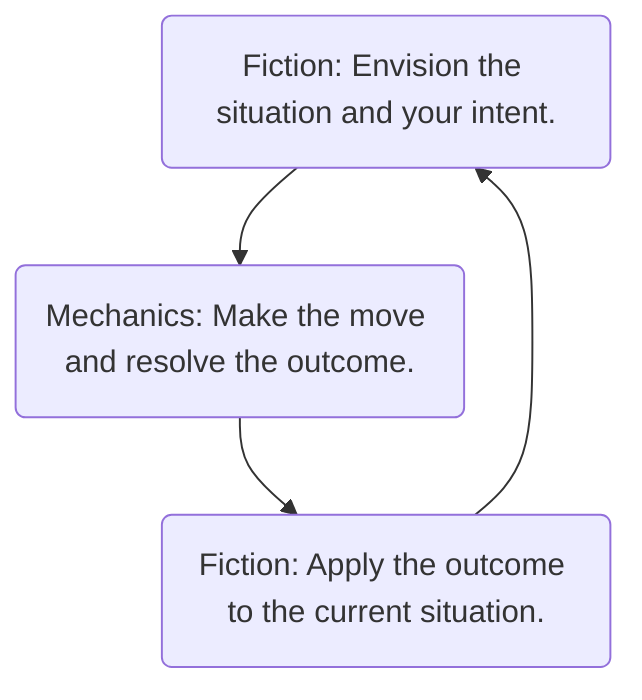

# The Mechanics and the Fiction

^00e1e9

Ironsworn is a game. As such, it uses various mechanics to resolve situations and challenges. You make moves and roll dice. Your character uses stats, tracks, and assets as a representation of their abilities and readiness. The outcome of a move may have a mechanical impact, such as increasing your momentum track or reducing your health track. Managing your resources and making decisions based on a desired mechanical result is part of the challenge and fun of the game.

The fiction helps you define and understand your setting and your character. It guides your character’s background, personality, and motivations. It provides a framework for the situations you face, the world you inhabit, and the people and creatures you encounter. As you play, you take actions through the imagined perspective of your character. The fiction helps inform what happens next.

	The intersection of fiction and mechanics is what makes the roleplaying experience vibrant and compelling. Think of the mechanics as your needle and the fiction as your thread. Using them both, you will weave the tapestry of your Ironsworn story.
## Leading and Following with the Fiction
Without story, the game is an exercise in rolling dice. Without mechanics, your story lacks choices, consequences and surprises. An ideal session of Ironsworn leverages both the mechanics and the fiction, but leads and follows with the fiction.

What does that mean? Consider the fiction as the bookends to your moves. You start by picturing the situation. What is happening? What are you trying to do? How are you doing it? What opposes you? What complications might you face? If you are playing solo, envision it. If you are playing co-op, talk it out. If you are the GM, set the scene for your players and work with them to clarify any details.

Does the fiction trigger a move? If so, make it. Roll the dice. Deal with the mechanical outcome within the context of the current situation. If one of your status tracks—health, spirit, supply, or momentum—is adjusted as a result of a move, envision how this looks in the fiction. Don’t just move the numbers around. Picture what it means for your character’s readiness and well-being. Then, translate the result of your move back to the fiction. How does the situation change? What happens next?

### Finding Your Balance
The level of emphasis you give to the fiction varies by the situation and the desired pace of play. You can explore entire scenes—such as interactions with your allies and other characters—entirely through the fiction without engaging in moves. Other times, you may quickly gloss over the fiction to get on with things. That’s fine. Use the mechanics of moves to portray the inherent drama and uncertainty of character intent and obstacles, but always look for opportunities to add texture and vibrancy to your world through the fiction.
>[!example]-
>You envision a quick scene as you return home and gather your gear. There’s no move triggered here. You pack your supplies and don your armor. The mail shirt is heavier than you remember, as if weighed down by dark memories.
>
>You stand at the door for a moment. Your hand rests on the hilt of your sword. “A blade never bloodied is a waste of iron,” your mother once told you. You remember her words now, and say a quick prayer that your sword will not be drawn. It has seen enough blood.
>
>Time is short. You must begin your quest.
## Fictional Framing
Ironsworn does not emphasize situational mechanics. Instead, the details are often abstracted within your moves and are reliant on fictional framing.

Think of it like moving a chess piece. Is it a pawn or a queen? What square is it on? What other pieces are on the board? What is the state of the game? All of these considerations impact the move you make and what happens next. There are rules. You can’t simply decide to move a pawn three spaces or sweep the enemy pieces off the board.

Gameplay within Ironsworn is much less constrained than in chess, but is still framed by the rules of your narrative reality. Your actions and the events in your story need to make sense for the characters, the setting, and the fiction you have established through play. Your character’s background, skills, beliefs, goals, and equipment all contribute to the actions you can take and how you envision those actions—even when those elements aren’t defined by a stat or asset. NPCs don’t have detailed mechanical attributes, but are portrayed as appropriate to the characteristics and intent you’ve established through play.

Fictional framing is your polestar. It helps create a character, a world, and situations which feel authentic and consequential.

>[!question] How does fictional framing impact play?
>- It adds texture to your story. Adding detail enriches your narrative, creates opportunities for new challenges and quests, and helps you visualize your character and your world.
>- It determines the moves you cannot make. If you are not properly equipped or positioned to make a move, you can’t do it. Without a very strong incentive, you can’t Compel a hated enemy to help you.
>- It determines the moves you must make, or those you can avoid. If you are unarmed and want to Strike a spear-wielding foe, you should Face Danger or Secure an Advantage to get in close. If you need information from someone and already have their trust and cooperation, you won’t need to Compel them before you can Gather Information.
>- It guides the outcomes of your moves. Look to the fiction when you have a question about the outcome of a move, especially when you Pay the Price. Do you suffer a mechanical result such as harm? Do you face a new narrative complication? If in doubt, Ask the Oracle and apply the context of your fictional framing to interpret the answer.
>- It helps determine the rank of your challenges. The rank you give to your quests, journeys, and fights is influenced by the scope of the challenge within the fiction.

>[!example]-
>For example, imagine you are caught within a snow storm while traveling. Winter in the Ironlands can be brutal. How does this storm and your character’s readiness impact your story? Establishing facts through your fiction, whether as an outcome of a move or simply as a narrative flourish, helps frame the challenges you face.
>
>#### The narrative texture of your story.
>If you encounter a harsh winter storm in your travels, the driving snow and biting wind adds evocative details to your journey.
>#### The moves you $CANNOT$ make
>If you are exiled from a community, you can't Sojourn there to seek shelter from the storm.
>#### The moves you $MUST$ make (or $CAN AVOID$).
>If you are caught in the storm without a heavy cloak and furs, you'll need to Face Danger to withstand the brutal cold.
>#### The outcome of your moves
>If you score a miss as you Face Danger to endure against the storm, you will likely suffer harm, stress or a loss of supply. Or, perhaps you encounter a threat even greater than the storm.
>#### The rank of your challenges
>The frostbound emerges from the blinding snow, its dead eyes flaring with a cold light. You grip your sword, your hands shaking and numb, and Enter the Fray. You decide the frostbound would be mystically empowered by the winter storm, so you set its rank one higher. This makes it an extreme foe.

In co-op and guided modes, you collaborate to create a shared understanding of the current situation. If something is unclear or at odds with the assumptions of another player, take a moment to talk it out until everyone has a clear picture of the situation. When playing solo, you are the arbiter of this fictional reality. Either way, find opportunities to increase the stakes and introduce dramatic new challenges and conflicts. Bend the fiction, but don’t break it. Push your characters. Subvert your expectations.

>[!example]-
>You must set off in pursuit of the trade caravan, but traveling on foot doesn’t make sense within the established fiction. They have a lead of more than a day. Catching up with them requires a horse.
>
>The characteristics of a horse aren’t defined within the Ironsworn rules. We’re not concerned with how much a horse costs, its travel distance per day, how fast it can run, or how much it eats. The Horse companion would give Saskia a mechanical bonus in some situations, but you don’t have that asset as part of your character.
>
>The function of a horse, then, is to add narrative texture to your travels and influence the moves you can make and their outcome. For now, traveling on horseback gives you the fictional framing you need to Undertake a Journey in pursuit of the trade caravan.
>
>Does Saskia own a riding horse? You decide to Ask the Oracle, and give it 50/50 odds.
>
>“No,” the oracle answers. So, where do you go from here? It’s reasonable to assume the overseer’s wife would lend you a horse.
>
>This is part of the fictional framing you have established through your campaign setup and initial play. You are attempting to help the overseer, who is a friend. You have sworn an iron vow to do so. Borrowing a horse from her wife doesn’t sound like a situation which is uncertain or risky, and thus wouldn’t require a Compel move.
>
>You envision this horse, one of the overseer’s mares. It has a buckskincolored hide and a black mane. You give it a name, Nakata, and write it down.
>
>To flesh out a bit of detail for this animal, you roll on the Character Descriptor table, and the oracle responds, “Wary.” You make note of that as well. This horse will be skittish. If you find yourself in a perilous situation, you may need to Face Danger to control it. A horse can also be injured or killed as part of the narrative outcome of a failed move. 
>
>For now, you’ve got your horse. Time to go.
## Representing Difficulty
You might be familiar with roleplaying games that give various tasks a difficulty rating or modifier. The flexibility to make each toss of the dice contextual, to adjust the chance to succeed based on the situation, creates an experience which helps simulate your imagined reality.

However, the Ironsworn rules do not utilize fine-grained mechanics for the difficulty of a particular challenge or the abilities a foe can bring to bear. Instead, the requirements to overcome challenges in your world are primarily represented through your fictional framing
### From Hell's Heart, I Stab at Thee
A leviathan is an ancient sea beast (page 154). It’s tough to kill because of its epic rank, and it inflicts epic harm, but it doesn’t have any other mechanical characteristics. If we look to the fiction of the leviathan’s, description, we see “flesh as tough as iron.” But, rolling a Strike against a leviathan is the same as against a common thug. In either case, it’s your action die, plus your stat and adds compared to the challenge dice. Your chances to score a strong hit, weak hit, or miss are the same.

So how do you give the leviathan its due as a terrifying, seemingly invulnerable foe? You do it through the fiction.

If you have sworn a vow to defeat a leviathan, are you armed with a suitable weapon? Punching it won’t work. Even a deadly weapon such as a spear would barely get its attention. Perhaps you undertook a quest to find the Abyssal Harpoon, an artifact from the Old World, carved from the bones of a longdead sea god. This mythic weapon gives you the fictional framing you need to confront the monster, and finding it can count as a milestone on your vow to destroy this beast.

Even with your weapon at the ready, can you overcome your fears as you stand on the prow of your boat, the water surging beneath you, the gaping maw of the beast just below the surface? Face Danger with +heart to find out.

The outcome of your move will incorporate the leviathan’s devastating power. Did you score a miss? The beast smashes your boat to kindling. It tries to drag you into the depths. Want to Face Danger by swimming away? You can’t outswim a leviathan. You’ll have to try something else.

Remember the concepts behind fictional framing. Your readiness and the nature of your challenge may force you to overcome greater dangers and make additional moves. Once you’ve rolled the dice, your fictional framing provides context for the outcome of those moves.

### Adjusting Challenge Ranks
When you Undertake a Journey, Enter the Fray, or Swear an Iron Vow, consider the fictional framing as you set the rank of the challenge. 

>[!example]- 
>- Does your voyage to the leviathan’s hunting ground take you over rough seas and near mist-shrouded rocks? That sounds like it’s worth notching up the rank when you Undertake a Journey.
>- Have you negotiated with a clan overseer to gain the aid of his fleet? When you Enter the Fray against the leviathan alongside these NPCs, you can reasonably reduce its rank by a step or two. This alliance might also allow you to Reach a Milestone and mark progress on your quest.

The rank can reflect your desired pace of play. Adjust the fiction and set the rank as appropriate to the amount of focus you want to give this challenge in your story. But, don’t go easy on your character. Prevailing or failing against overwhelming odds is the stuff of great stories. Be epic. Or die trying.
## Zooming in and Out
As the writer, director, and editor of your story (or collaborating as such with others at your table), you have control over how you manage scenes within the visualized fictional space you create.

Imagine you are in a desperate battle. Your opponent is one of the firstborn, a giant, wielding a brutal-looking axe. He’s an outcast of his own clan, and is warring against the Ironlanders. He’s nine feet tall. Scary as hell.

You fight with a spear and shield. You Face Danger, ducking under a wild swing of the axe. A strong hit. You have initiative. Next, you Strike, lunging with the spear, and roll a weak hit. You slam the spear into the giant’s leg.

That’s 2 harm. Mark the progress. Unfortunately, your foe has the initiative. What happens next?

Imagine time frozen. Picture the scene. Morning mist hangs above the ground. The sun is low, casting long shadows. Specks of blood are suspended in the air. Your expression is a mix of determination and fear as your eyes focus on the point of the spear, embedded in the giant’s massive leg. He is reacting to the hit, head back, mouth agape. His massive axe is held high.

This is a moment of high drama. Linger on it for a moment. Imagine what the giant does next. Does he attack with the axe? Does he kick at you? Does he try to grab your spear and snap it in half? Look to the fiction. If you’re unsure, or want to leave it open to fate, Ask the Oracle.

Time moves again. The frantic battle continues. The giant acts. You react. Roll for it, and interpret the result. Remember: It’s fiction first, then the move, then back to the fiction as you resolve the outcome. If it’s interesting, supports your fictional framing, and compounds the tension, make it happen.

Even in a situation where seconds count, such as combat, you can shift the focus and flow of time. A Strike might be a single, decisive blow. Or, it might represent a flurry of attacks and blocks leading to a pivotal moment. Don’t treat a fight as a series of discrete rounds. Mix it up. There’s even a special move for combat, Battle (page 84), which lets you zoom out and abstract an entire engagement in a single roll.

Later, after you’ve defeated the giant, you continue on your quest. You’re making your way into the mountains. You roll to Undertake a Journey and score a weak hit. You imagine it as a montage. You are moving from dense forest into jagged hills. You rest only once, pausing to eat alongside the banks of a surging river. Your eyes are narrowed and your expression wearied as you scan the difficult terrain ahead.

Time is compressed. An entire day passes. If your roll had failed, something went wrong. What happened? Find out, then slow down and zoom in if appropriate.

This is the ebb and flow of play. Time is fluid. The moves help dictate this flow, but you also have control. If it’s interesting to you, if it impacts your story, focus on it. If not, abstract it.

>[!example]- 
>You set off on your quest. You envision looking back one last time at your village, muttering a prayer to the old gods to keep the overseer alive until you return.
>
>You make the Undertake a Journey move, giving your journey a rank of dangerous, and roll a strong hit. You mark progress, and take the option to preserve your supply. You zoom out to envision a good first day of travel. You head south along the trade road, which is little more than a muddy path meandering through the low hills. The weather is fair. You catch a nice fat rabbit for dinner.
>
>You Ask the Oracle for guidance on your first waypoint by rolling on the Location (page 176) and Location Descriptor (page 177) tables. The oracle answers, “Mystic site” and “Beautiful.”
>
>You interpret this answer as a set of standing stones the locals call ‘The Three Maidens’. Looking for a bit more detail, you roll on the Action and Theme tables. The oracle responds, “Communicate Dreams.”
>
>That night, as you sleep, three spectral women appear and speak to you urgently in a language you don’t understand. Do these spirits offer a blessing or a curse? You make note of this enigmatic vision. It could be an interesting narrative hook to explore later.
>
>You Undertake a Journey three more times, rolling hits and marking progress. You mostly stay zoomed out, picturing Saskia keeping a resolute pace in pursuit of the caravan. Then, you Make Camp, but score a miss. You envision a troubled and anxious night, plagued by bad dreams, and Endure Stress.
>
>On the next segment of your journey, you also score a miss. Per the move, you are “waylaid by a perilous event.” Your roll is a match, which means you have an opportunity to introduce a dramatic twist. 
>
>It’s time to zoom in...